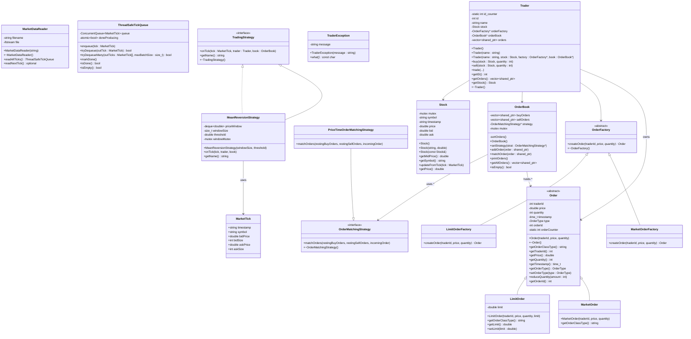

# Mini Quant Trading Engine

```mermaid
classDiagram
%%    class Trader {
%%        +placeOrder()
%%        +cancelOrder()
%%    }
%%    class OrderBook {
%%        +addOrder(order)
%%        +matchOrder(order)
%%    }
%%    class Order {
%%        +id
%%        +price
%%        +quantity
%%    }
%%    class MarketOrder
%%    class LimitOrder
%%
%%    Order <|-- MarketOrder
%%    Order <|-- LimitOrder
%%    Trader --> OrderBook : uses
%%    OrderBook --> Order : stores

    class MarketTick {
        +string timestamp
        +string symbol
        +double bidPrice
        +int bidSize
        +double askPrice
        +int askSize
    }

    class MarketDataReader {
        -string filename
        -ifstream file
        +MarketDataReader(string)
        +~MarketDataReader()
        +readAllTicks() ThreadSafeTickQueue*
        +readNextTick() optional<MarketTick>
    }

    class Stock {
        -mutex mutex
        -string symbol
        -string timestamp
        -double price
        -double bid
        -double ask
        +Stock()
        +Stock(string, double)
        +Stock(const Stock&)
        +getMidPrice() double
        +getSymbol() string
        +updateFromTick(tick : MarketTick)
        +getPrice() double
    }

    class ThreadSafeTickQueue {
        -ConcurrentQueue~MarketTick~ queue
        -atomic~bool~ doneProducing
        +enqueue(tick : MarketTick)
        +tryDequeue(outTick : MarketTick) bool
        +tryDequeueMany(outTicks : MarketTick[], maxBatchSize : size_t) bool
        +markDone()
        +isDone() bool
        +isEmpty() bool
    }

    class Order {
        <<abstract>>
    }

    class OrderMatchingStrategy {
        <<interface>>
        +matchOrders(restingBuyOrders, restingSellOrders, incomingOrder)
        +~OrderMatchingStrategy()
    }

    class PriceTimeOrderMatchingStrategy {
        +matchOrders(restingBuyOrders, restingSellOrders, incomingOrder)
    }

    class OrderBook {
        -vector~shared_ptr<Order>~ buyOrders
        -vector~shared_ptr<Order>~ sellOrders
        -OrderMatchingStrategy* strategy
        -mutex mutex
        -sortOrders()
        +OrderBook()
        +setStrategy(strat : OrderMatchingStrategy*)
        +addOrder(order : shared_ptr<Order>)
        +matchOrder(order : shared_ptr<Order>)
        +printOrders()
        +getAllOrders() vector~shared_ptr<Order>~
        +isEmpty() bool
    }

    PriceTimeOrderMatchingStrategy --|> OrderMatchingStrategy
    OrderBook --> OrderMatchingStrategy : uses *
    OrderBook --> Order : holds *

    class Order {
        <<abstract>>
        -int traderId
        -double price
        -int quantity
        -time_t timestamp
        -OrderType type
        -int orderId
        -static int orderCounter
        +Order(traderId, price, quantity)
        +~Order()
        +getOrderClassType() string
        +getTraderId() int
        +getPrice() double
        +getQuantity() int
        +getTimestamp() time_t
        +getOrderType() OrderType
        +setOrderType(type : OrderType)
        +reduceQuantity(amount : int)
        +getOrderId() int
    }

    class LimitOrder {
        -double limit
        +LimitOrder(traderId, price, quantity, limit)
        +getOrderClassType() string
        +getLimit() double
        +setLimit(limit : double)
    }

    class MarketOrder {
        +MarketOrder(traderId, price, quantity)
        +getOrderClassType() string
    }

    class OrderFactory {
        <<abstract>>
        +createOrder(traderId, price, quantity) Order*
        +~OrderFactory()
    }

    class LimitOrderFactory {
        +createOrder(traderId, price, quantity) Order*
    }

    class MarketOrderFactory {
        +createOrder(traderId, price, quantity) Order*
    }

    Order <|-- LimitOrder
    Order <|-- MarketOrder
    OrderFactory <|-- LimitOrderFactory
    OrderFactory <|-- MarketOrderFactory

    class TradingStrategy {
        <<interface>>
        +onTick(tick : MarketTick, trader : Trader, book : OrderBook)
        +getName() string
        +~TradingStrategy()
    }

    class MeanReversionStrategy {
        -deque~double~ priceWindow
        -size_t windowSize
        -double threshold
        -mutex windowMutex
        +MeanReversionStrategy(windowSize, threshold)
        +onTick(tick, trader, book)
        +getName() string
    }

    class TraderException {
        -string message
        +TraderException(message : string)
        +what() const char*
    }

    class Trader {
        -static int id_counter
        -int id
        -string name
        -Stock stock
        -OrderFactory* orderFactory
        -OrderBook* orderBook
        -vector~shared_ptr<Order>~ orders
        +Trader()
        +Trader(name : string)
        +Trader(name : string, stock : Stock, factory : OrderFactory*, book : OrderBook*)
        +buy(stock : Stock, quantity : int)
        +sell(stock : Stock, quantity : int)
        +trade(...)
        +getID() int
        +getOrders() vector~shared_ptr<Order>~
        +getStock() Stock
        +~Trader()
    }

    MeanReversionStrategy --|> TradingStrategy
    Trader --> Stock
    Trader --> OrderBook
    Trader --> OrderFactory
    Trader --> Order : owns
    TradingStrategy <|.. MeanReversionStrategy
    MeanReversionStrategy --> MarketTick : uses
```
