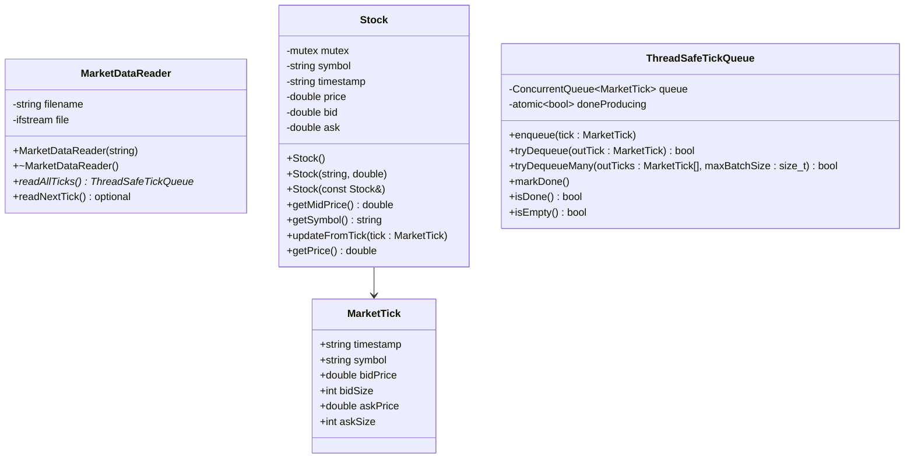
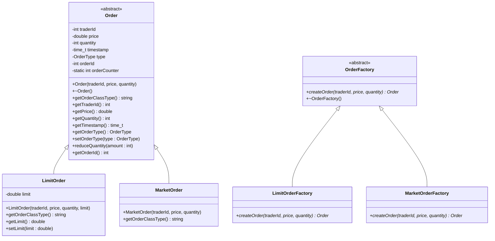
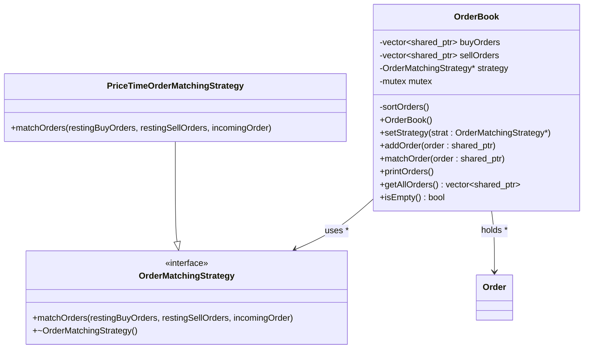
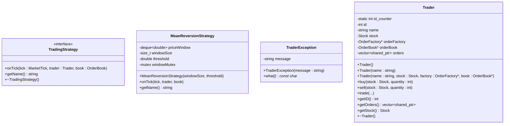
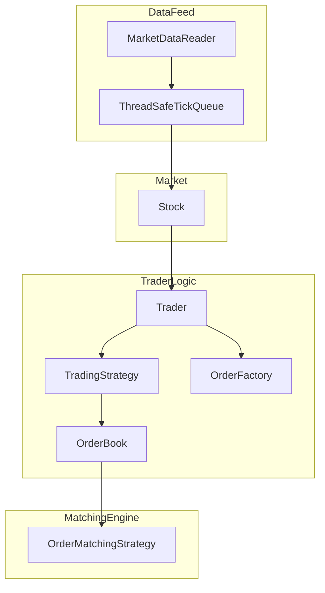

# Mini Quant Trading Engine

## Overview
This project is a miniature quantitative trading engine written in modern C++, designed to simulate trading a single stock using real-world 
market data. It replicates core components of a real trading system, such as order creation, matching logic, and strategy execution, while 
focusing on performance, modularity, and code clarity. The project takes inspiration from 
[this](https://medium.com/@eminalbandyan1/building-a-multi-threaded-stock-trading-system-in-c-3aac8e282c3b) article.

The engine features:
- **Market Data Integration**: Parses real market tick data from CSV files and streams it into the system in simulated real time.
- **Order Management System**: Supports both Market Orders and Limit Orders, with factories to instantiate them and a centralized OrderBook to manage trades.
- **Matching Engine**: Uses a pluggable matching strategy system (e.g., price-time priority) to simulate realistic trade matching.
- **Strategy Engine**: Implements a basic mean reversion trading strategy which reacts to price movements within a sliding window.
- **Multithreading**: Decouples data ingestion and strategy execution using a thread-safe tick queue, simulating concurrent real-time systems.
- **Modular Architecture**: The system is highly extensible, allowing easy swapping or enhancement of components such as strategies or order types.
- **Performance Focus**: Designed with performance in mind, including mutex protection, object reuse, and minimal allocations.

## Project architecture
The system is organised into modular components, each responsible for a particular function in the trading pipeline. This approach allows
for a clear separation of functionality, facilitating smooth testing, performance benchmarking and extensibility. The project contains 4 
modules: 
- Market Data
- Order System 
- Orderbook with matching strategy 
- Trader with trading strategy. 

### Market Data Module

### Order System Module

### Order book and matching strategy

### Trader and trading strategy

## Modules in action!

### 🧩 System Overview

