# Mini Quant Trading Engine

> A high-performance, modular C++ engine that simulates real-world trading of a single stock using real-time market data.

## Overview
This project is a miniature quantitative trading engine written in modern C++, designed to simulate trading a single stock using real-world
market data. It replicates key components of a real-world trading system—order creation, order matching, and strategy execution—with a 
focus on:
- Modularity
- Multithreaded execution
- Performance
- Clean, extensible design

> Inspired by [this](https://medium.com/@eminalbandyan1/building-a-multi-threaded-stock-trading-system-in-c-3aac8e282c3b) article.

## Features
- Market Data Integration – Parses and streams real bid/ask tick data from CSV files
- Order Management System – Supports Market & Limit Orders using a Factory Pattern 
- Matching Engine – Modular matching via pluggable strategies like Price-Time 
- Strategy Engine – Implements a Mean Reversion Strategy based on a sliding window 
- Multithreading – Producer-consumer model for real-time simulation 
- Performance-Oriented – Low-overhead queues, thread-safe components, and minimal allocations 
- Clean Architecture – Organized modules for smooth testing, extensibility, and benchmarking

## Project architecture
The system is organised into modular components, each responsible for a particular function in the trading pipeline. This approach allows
for a clear separation of functionality, facilitating smooth testing, performance benchmarking and extensibility. The project contains 4 
modules: 
- **Market Data**: Parses and streams CSV data
- **Order System**: Creates and defines order types
- **Orderbook with matching strategy**: Executes trades based on logic
- **Trader & trading strategy**: Makes buy/sell decisions in real-time

### Market Data Module

```mermaid
classDiagram 
    class MarketTick {
        +string timestamp
        +string symbol
        +double bidPrice
        +int bidSize
        +double askPrice
        +int askSize
    }

    class MarketDataReader {
        -string filename
        -ifstream file
        +MarketDataReader(string filename)
        +~MarketDataReader()
        +readAllTicks() ThreadSafeTickQueue*
        +readNextTick() MarketTick
    }

    class Stock {
        -mutex mutex
        -string symbol
        -string timestamp
        -double price
        -double bid
        -double ask
        +Stock(string symbol, double price)
        +getMidPrice() double
        +getSymbol() string
        +updateFromTick(MarketTick& tick)
        +getPrice() double
    }

    class ThreadSafeTickQueue {
        -ConcurrentQueue~MarketTick~ queue
        -atomic~bool~ doneProducing
        +enqueue(MarketTick& tick)
        +tryDequeue(MarketTick& outTick) bool
        +tryDequeueMany(MarketTick[] outTicks, size_t maxBatchSize) bool
        +markDone()
        +isDone() bool
        +isEmpty() bool
    }
    
    Stock <-- MarketTick : updates
    MarketTick <-- ThreadSafeTickQueue : stores
    MarketDataReader --> ThreadSafeTickQueue : pushes data
```

The Market Data module is designed to efficiently ingest, parse, store, and stream real-time bid-ask market data for a single stock symbol. 
It is composed of four core components: MarketTick, MarketDataReader, ThreadSafeTickQueue, and Stock. The MarketDataReader is responsible 
for reading market tick data from a CSV file, line-by-line or in bulk, and encapsulating each row as a MarketTick object that contains 
timestamped bid/ask information. Parsed ticks are then enqueued into the ThreadSafeTickQueue, a thread-safe streaming queue built using 
the high-performance [moodycamel ConcurrentQueue](https://github.com/cameron314/concurrentqueue), which is optimized for low-latency producer-consumer operations. This enables the system 
to decouple I/O-bound data ingestion from CPU-bound strategy processing. The Stock class maintains the current state of the market by 
updating its internal price and quote values every time it receives a new MarketTick. This modular architecture allows concurrent tick 
consumption by trading strategies while preserving accuracy and performance, forming the backbone of the engine’s real-time decision-making 
loop.

### Order System Module

The Order System module provides a flexible and extensible framework for creating and managing different types of orders within the trading
engine. At its core is the abstract Order class, which encapsulates common order attributes like price, quantity, trader ID, timestamp, and 
type (buy/sell). It also includes a unique order ID generator to track individual orders throughout their lifecycle. Specialized 
orders—MarketOrder and LimitOrder—inherit from this base class, implementing specific behaviors while maintaining a consistent interface. 
Order creation is delegated to corresponding factory classes (MarketOrderFactory and LimitOrderFactory), following the Factory Method 
Pattern, which promotes modularity and clean abstraction. This design allows easy extension of new order types in the future without 
altering existing logic. Together, these components form a robust and scalable order generation pipeline, ready to feed into matching and 
execution subsystems of the engine.

> Limit order objects created from the factory class need to be assigned a limit value using the `LimitOrder::setLimit(double limit)` function. 
Creating an object directly from the `LimitOrder` constructor allows the limit value to be assigned during object creation. 

### Order book and matching strategy

The Order Book and Matching Strategy module lies at the heart of the engine’s execution logic. It maintains two dynamically managed 
collections of resting buy and sell orders, while enforcing thread safety through fine-grained locking with `std::mutex`. At its core, 
the `OrderBook` class exposes functionalities to add new orders, invoke matching against existing ones, and query current book state.

To support multiple execution policies, the module uses the Strategy Pattern. The `OrderMatchingStrategy` interface defines a contract for 
matching logic, allowing the `OrderBook` to remain decoupled from specific execution algorithms. The default implementation, 
`PriceTimeOrderMatchingStrategy`, adheres to standard market convention—prioritizing orders based on price and then time. New strategies can 
be added by simply implementing the interface and injecting the strategy at runtime.

This modular design enables flexibility in how trades are executed and provides a clean foundation for simulating different market 
microstructure behaviors.

### Trader and trading strategy

This module encapsulates the decision-making and order-execution behavior of market participants. At its core is the `Trader` class, which 
represents an individual actor capable of placing buy/sell orders through an injected `OrderFactory` and routing them to the `OrderBook`. Each 
trader is assigned a unique ID, maintains a portfolio of submitted orders, and can subscribe to a trading strategy to automate decisions 
based on real-time market data.

Trading behavior is governed using the Strategy Pattern. The `TradingStrategy` interface defines a contract for reacting to tick-level data 
(`onTick`) and enables different styles of market behavior. The included `MeanReversionStrategy` implementation reacts to deviations from a 
moving average, executing buy or sell orders based on configurable thresholds.

This design allows for easy extensibility—new strategies can be implemented by subclassing `TradingStrategy`
and plugged in without modifying the core trading logic. All strategies operate in response to `MarketTick` updates.

## Modules in action!
### 🧩 System Overview

